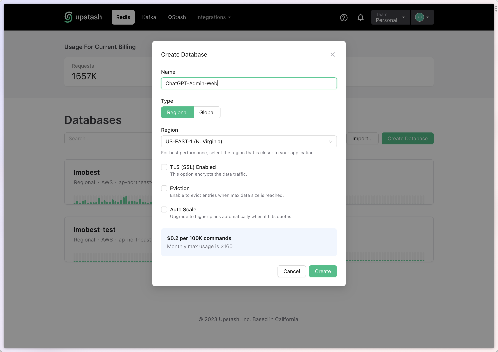
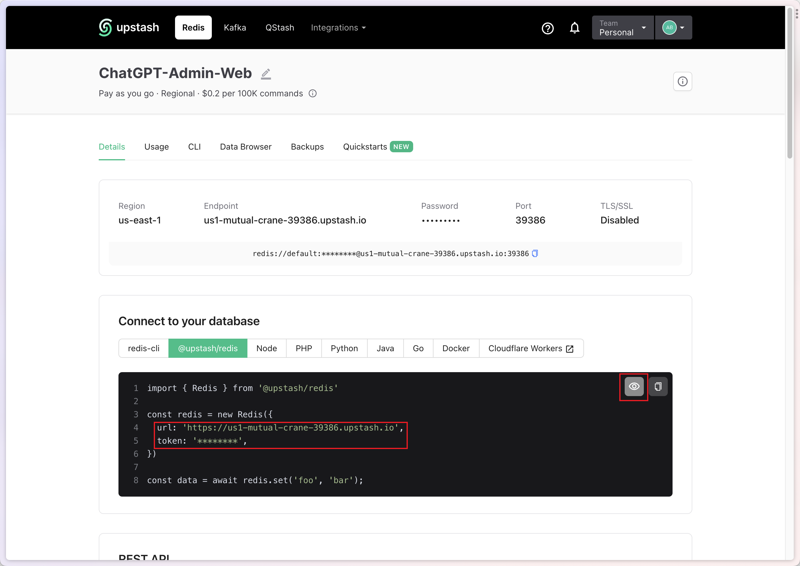
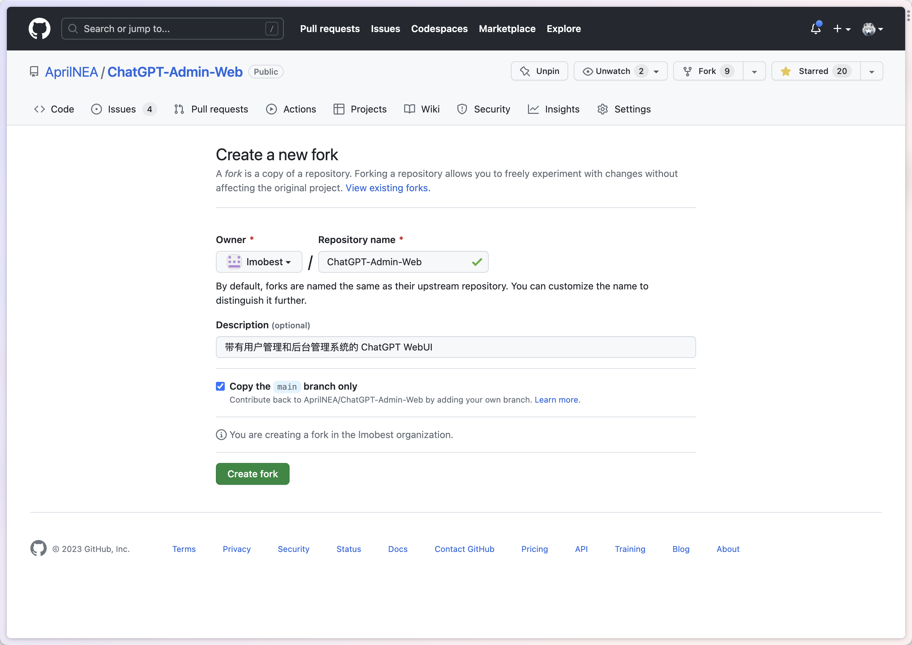
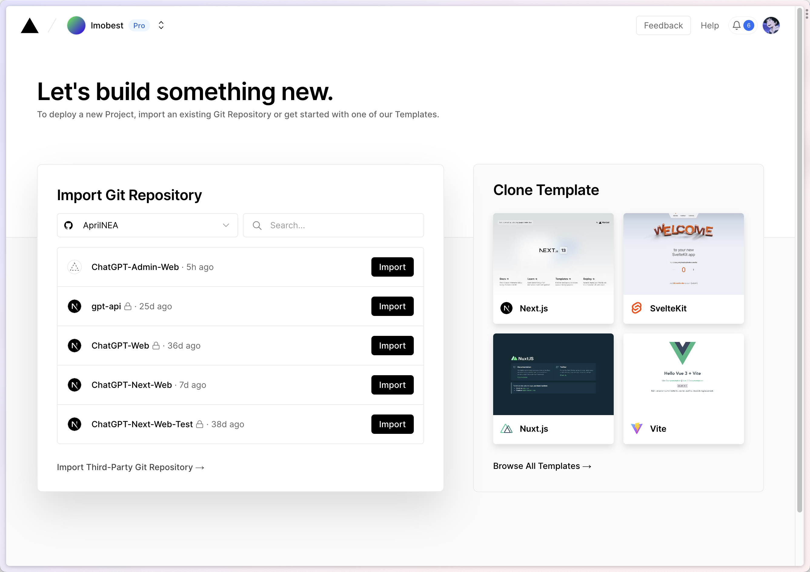
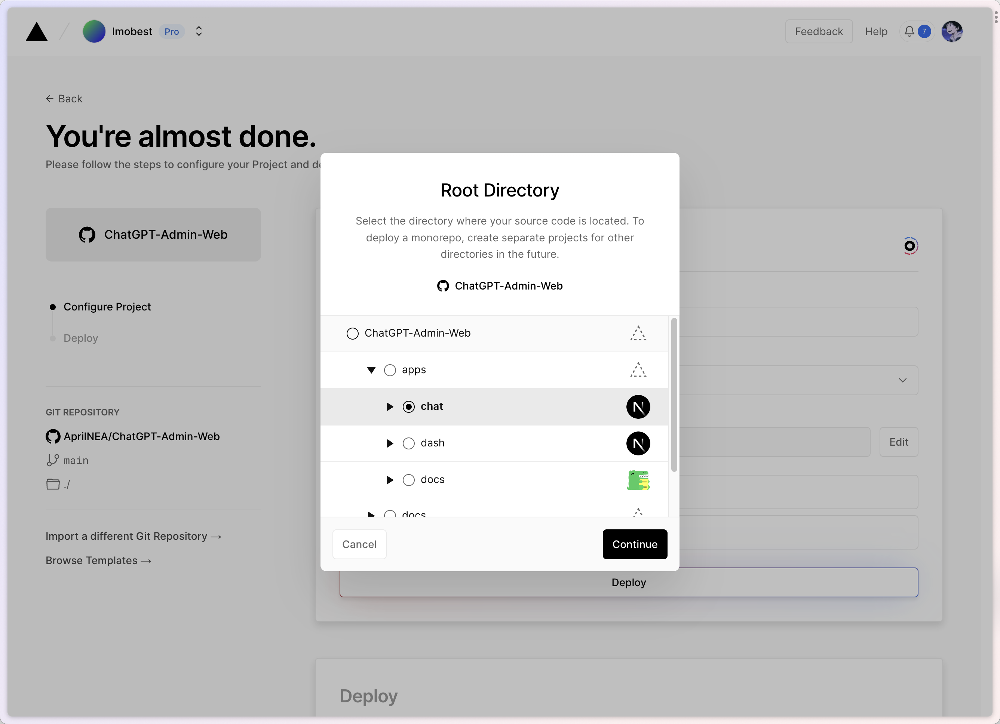
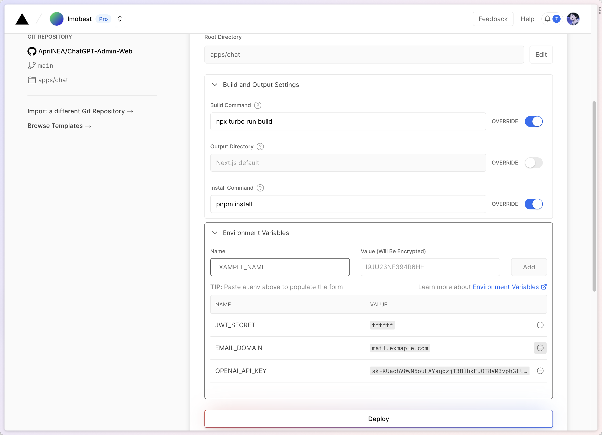

# 快速开始

在本章中，我们将会带你快速设置好一个 Upstash Redis 数据库并在 Vercel 的部署本项目。

## 创建数据库

在本教程中，我们将指导您如何在 Upstash 中创建 Redis 数据库。

Upstash 是一个提供即用的 Redis 云服务，它允许您轻松地创建和管理数据库。

### 步骤1：注册和登录

访问 Upstash 官网：https://upstash.com。

单击右上角的“Sign Up”（注册）按钮，填写相关信息以创建一个新账户。

如果您已经注册，请点击“Log In”（登录）按钮。

登录成功后，您将进入 Upstash 控制台。

### 步骤2：创建数据库


在 Upstash 控制台，点击左侧菜单栏中的 “Databases”（数据库）选项。

点击右上角的 “Create Database”（创建数据库）按钮。

在创建数据库的对话框中，填写以下信息：

Database Name（数据库名称）：为您的数据库起一个有意义的名称。

Region（地区）：选择最靠近您或您的用户的数据中心。

Database Plan（数据库套餐）：根据您的需求选择合适的套餐。对于入门级用户，可以选择免费套餐。

点击“Create”（创建）按钮。

> 关于 Region 和 Global 的区别，您可以参考 Upstash 的文档。

### 步骤3：获取连接信息



创建成功后，您将看到新创建的数据库出现在“Databases”列表中。

点击数据库名称以查看详细信息。

| 连接信息  | 环境变量名称      | 
|-------|-------------|
| url   | REDIS_URL   |    
| token | REDIS_TOKEN |     

## 在 Vercel 中部署项目

### 步骤1: Fork 仓库



将仓库 fork 至自己的名下

### 步骤2: 在 Vercel 中导入改项目



### 步骤3: 设置 Root Directory



### 步骤4: 更新部署指令



如上图所示，在`Build and Output Settings`中，修改 `Build Command`和`Install Command`。

**Build Command**
``` bash
npx turbo run build
```

**Install Command**
``` bash
pnpm install
```

### 步骤5: 设置环境变量

在快速开始中，你只需要部署以下环境变量，即刻开始项目。

| 环境变量        | 解释                 | 来源                                                               |
|-------------|--------------------|------------------------------------------------------------------|
| OPENAI_API_KEY  | OpenAI 的连接密钥       | OpenAI                                                            |  
| JWT_SECRET  | 加密 JWT 的密钥，随机字符串即可 | 可以在[1password](https://1password.com/password-generator/)中随机生成一个 |    
| REDIS_URL   | Upstash 的连接地址      | Upstash                                                          |  
| REDIS_TOKEN | Upstash 的连接密钥      | Upstash                                                          |  

:::caution

当未设置邮箱验证或手机验证时，用户可随意填写邮箱及密码来进入您的服务。

:::

:::danger

当未设置文本安全服务时，你的网站可能很快被封禁。

:::


完整的环境变量请见配置说明。

