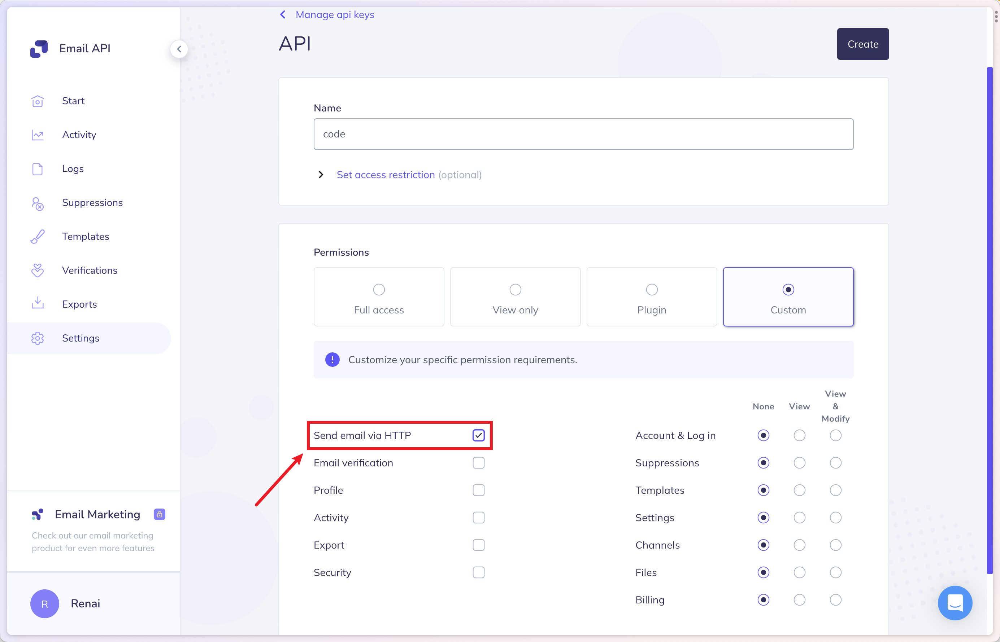

### 注册并验证域名/邮箱

| 环境变量的名称(NAME)             | 环境变量的内容(KEY)         | 备注                                      |
|---------------------------|----------------------|-----------------------------------------|
| NEXT_PUBLIC_EMAIL_SERVICE | `elastice`           | 选择 `elastice` 发件服务                      |
| ELASTICE_EMAIL_SENDER     | elastice 要使用的发件人邮箱地址 | 必填，邮箱域名 eg: `no-reply@mail.example.com` |
| ELASTICE_EMAIL_API_KEY    | elastice 账户的 API KEY | 必填                                      |

### API KEY

创建 API KEY 的时候注意，请勾选图上的权限：

相关 ISSUE: [#24](https://github.com/AprilNEA/ChatGPT-Admin-Web/issues/24)
