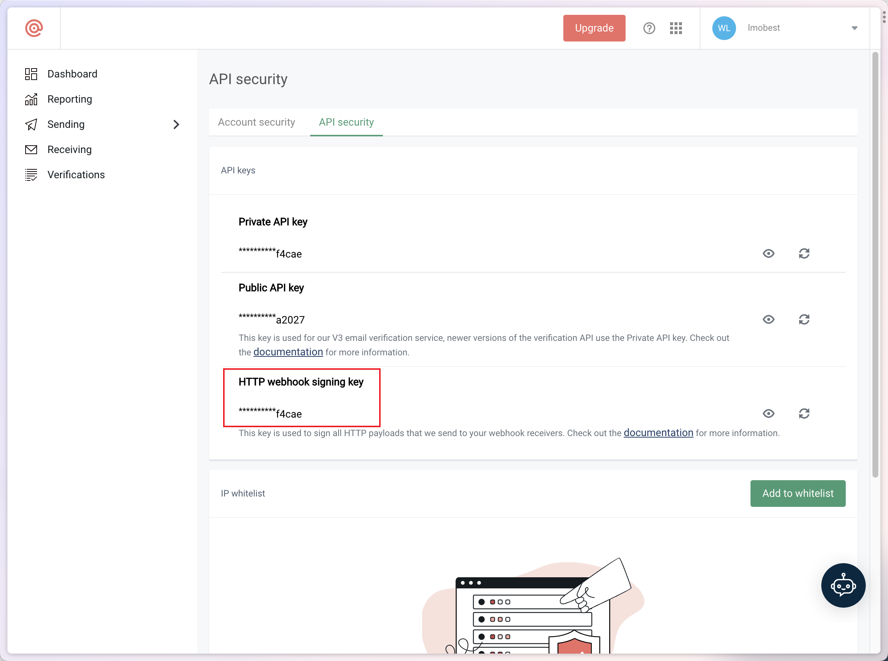
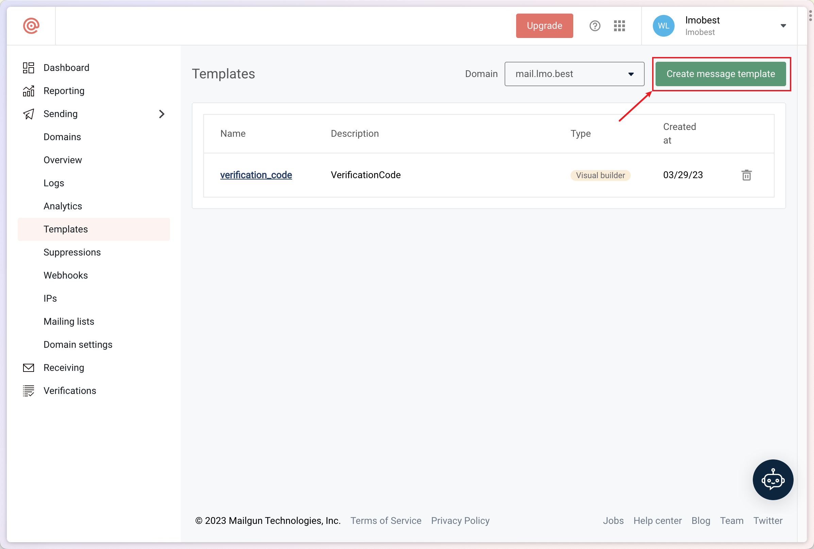
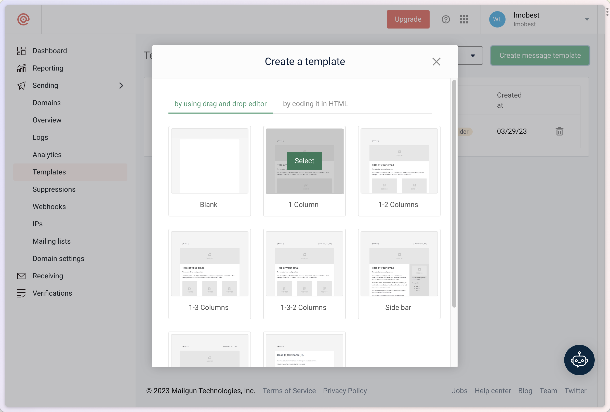
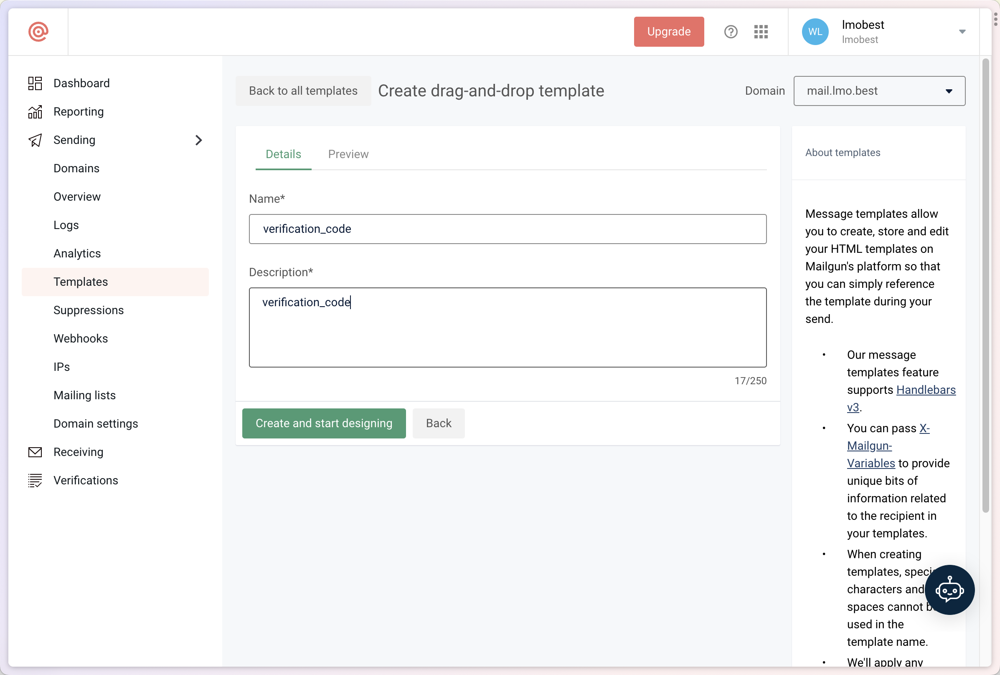
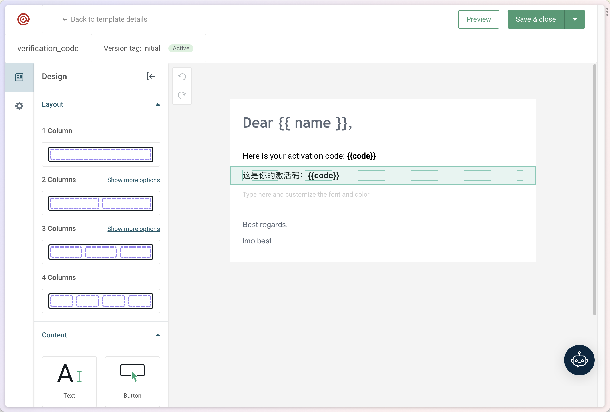

### 注册 mailgun 并获取以下变量

API_KEY 可在账户中如下图位置找到：

| 环境变量的名称(NAME)             | 环境变量的内容(KEY)        | 备注                             |
|---------------------------|---------------------|--------------------------------|
| NEXT_PUBLIC_EMAIL_SERVICE | `mailgun`           | 选择 `mailgun` 发件服务              |
| MAILGUN_EMAIL_DOMAIN      | mailgun 要使用的邮箱域名    | 必填，邮箱域名 eg: `mail.example.com` |
| MAILGUN_EMAIL_API_KEY     | mailgun 账户的 API KEY | 必填                             |

### 新建邮件模版

选中模板样式：

确保 Name 填入 `verification_code` 无误

自行配置模版样式，确保在页面中通过花括号设置`name`和`code`变量，如图所示。

保存模版。
