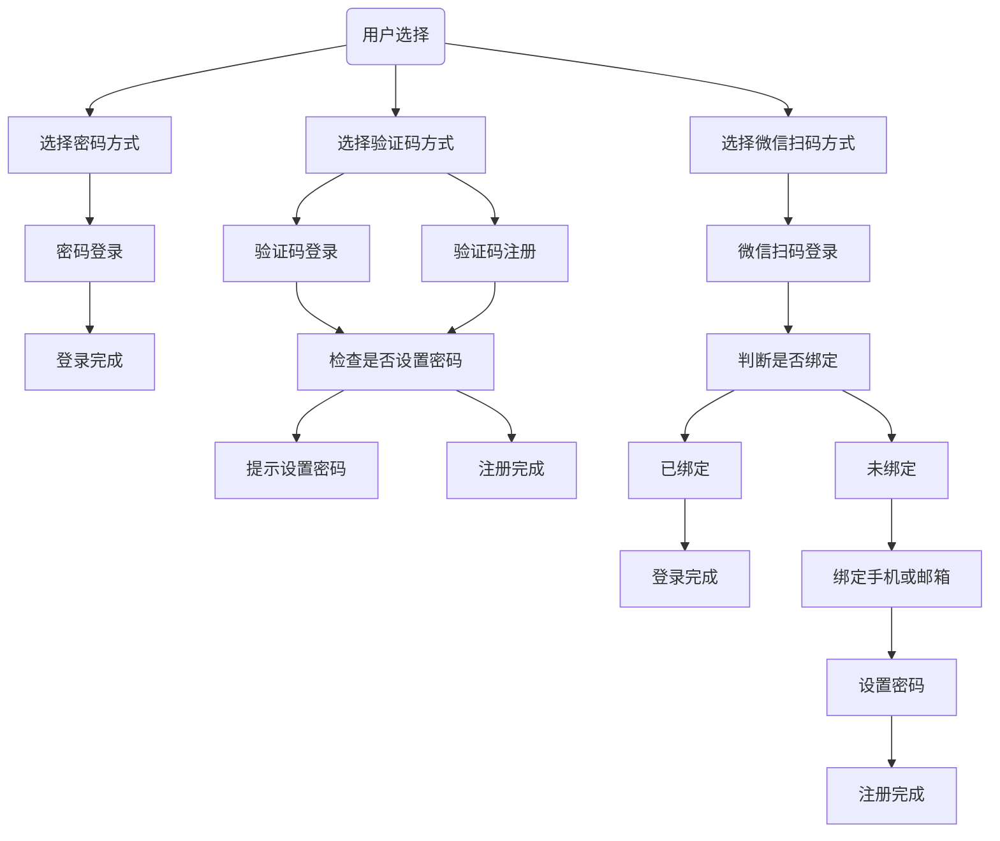

# 认证部分

```mermaid
graph TD

    %% 开始节点
    start(用户选择)

    %% 密码方式
    start --> passwordChoice[选择密码方式]

    passwordChoice --> passwordLogin[密码登录]
    passwordLogin --> endPasswordLogin[登录完成]

    %% 验证码方式
    start --> codeChoice[选择验证码方式]

    codeChoice --> codeLogin[验证码登录]
    codeLogin --> checkPasswordCode[检查是否设置密码]


    codeChoice --> codeRegister[验证码注册]
    codeRegister --> checkPasswordCode[检查是否设置密码]
    checkPasswordCode --> setPasswordCodeRegister[提示设置密码]
    checkPasswordCode --> endCodeRegister[注册完成]

    %% 微信扫码方式
    start --> wechatChoice[选择微信扫码方式]

    wechatChoice --> wechatLogin[微信扫码登录]
    wechatLogin --> ifBind[判断是否绑定]
    ifBind --> alreadyBind[已绑定]
    ifBind --> notBind[未绑定]
    alreadyBind --> endWechatLogin[登录完成]
    notBind --> bind[绑定手机或邮箱]
    bind --> setPasswordWechat[设置密码]
    setPasswordWechat --> endWechatRegister[注册完成]
```
